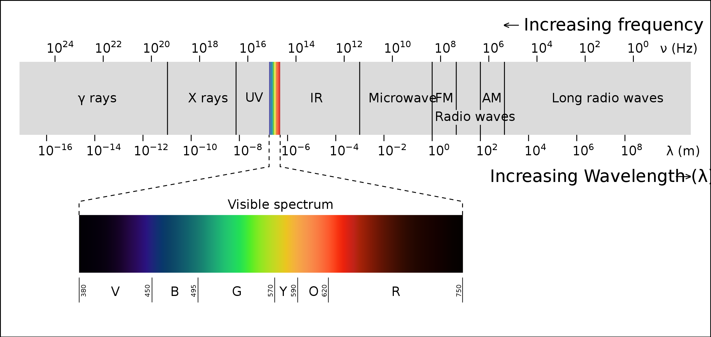
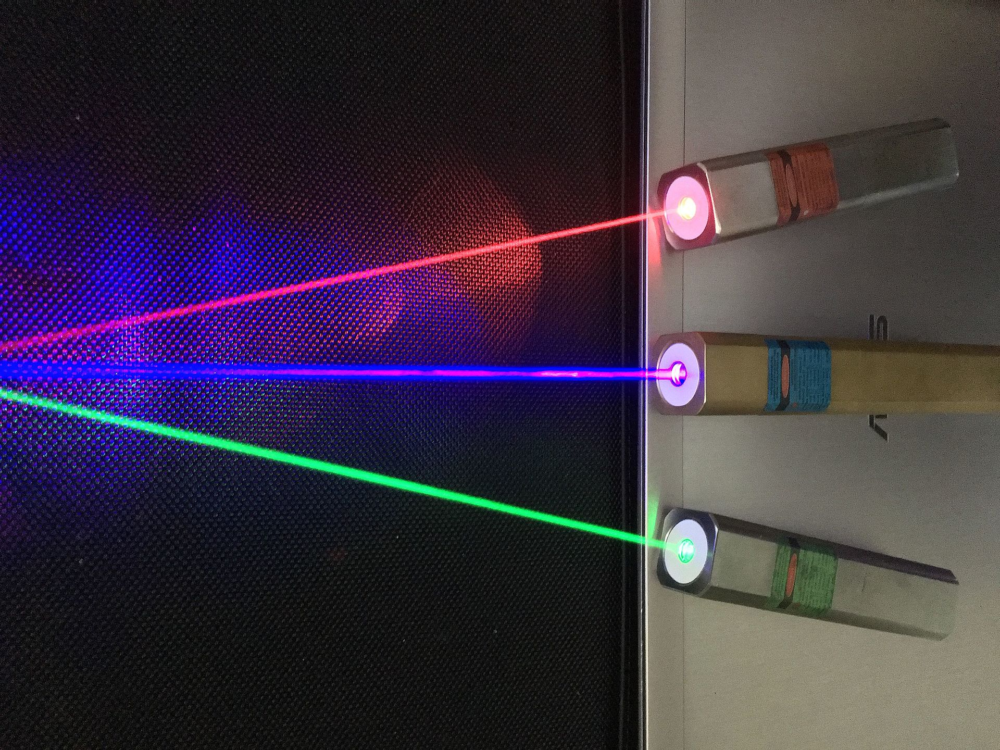
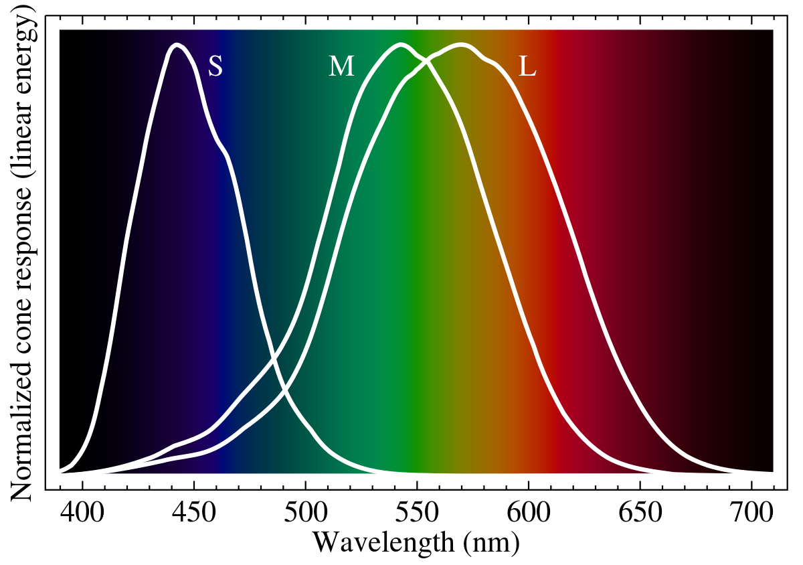

____
# Advanced Color Theory

Color plays an important role in communicating through visualization. Understanding color requires a bit of background knowledge in physics, biology and technology.  This webpage is an attempt to do bring these three area together in a coherent way so that we can understand and use color better. If you are not interested in this level of detail and only wish to know the basics of how spartan uses color, [this page](color_theory.md) might be more useful to you.

It is useful to break color science into three distinct areas: physics, biology and technology. Each of these areas treats color in quite different ways and without understanding each on its own terms, it is challenging to out them all together to understand what you are experiencing as you read this on your screen. Light is composed of colors and we need to understand how nature does that in terms of the laws that govern the universe. But, that light enters your eye and has a very complex interaction with the rods in cones in your retina, and that is before further processing in the topic nerve and brain. Then, there is the technology we have invented to mimic nature using what we know about our visual system.

Before we get started, let's first provide our first evidence that to understand color we need to understand all three areas. Look at the image below and allow your eye to follow the empty spot that moves around the magenta spots. Your screen is creating light of various colors to give you the sense that there are magenta spots with one being removed in sequence. What enters your eye is electromagentic radiation, the subject of the next section, created by the red-green-blue (RGB) pixels in your screen, covered in the technology section; _you only see magenta_. Now, look at the black dot in the center. Try to keep your gaze locked on that black dot without moving. What do you see now? What you see is a color that your screen is not creating and that is not in the electromagentic waves between your screen and your eyes. If you keep your eyes still enough, you will eventually see the magenta spots disappear! Just because you see a color does not mean that it is there. Just because you don't see a color does not mean that it is not there. This example illustrates the richness of color theory, and we will encounter more examples below. 

Let's get started.

____
### Physics

Before about a billion years ago there was, as far as we know, no life in the universe. While there was light, there were no animals to look at it. If there was a concept of color it was independent of biology and technology; who or what would have held this "concept"? What we know today is that light has always existed since the Big Bang and that it can be understood as being composed of electromagnetic waves. Those waves have various frequencies _f_ and form a spectrum (light with many values of _f_); in fact, we should be careful when we use the term "light" because the electromagnetic spectrum is filled with waves no animal can see, if there were animals around to see things. Today, we give different parts of this spectrum names to help us keep things organized. When the energy in the wave is very large, we would call the radiation "gamma rays". In the opposite limit, the low energy waves are called "radio waves". Because these are waves, we can also consider their wavelength. Gamma rays have a very short wavelength (about 0.0000000000000001 meters), whereas radio waves have a very long wavelengths ( about 100000000 meters). 

Take a look at this picture (thanks [Wikipedia](https://commons.wikimedia.org/w/index.php?curid=2521356)). You can see some of the names we have given these electromagnetic waves. You have certainly heard of x rays, which have very large _f_, since they are used for medical applications and you probably have used microwaves, which have quite low values of _f_, to heat your coffee. The important point to remember is that all of these waves, from gamma rays to radio waves are all exactly the thing, just with different wavelengths (or, energies if you prefer to think about it that way). Because we use these waves in very different ways in our everyday lives, it is tempting to think of the named waves is somehow different from the others. Fortunately, nature is simple when it comes to waves! In color theory the different electromagnetic waves are refered to as the "spectrum"; sometimes we use language that the frequency _f_ is a "color". This use of the term "color" is part of why color theory is confusing: the electromagnetic waves ("light") exist independent of us and no account for nervous system has been made. 

What enters your eye is a product of two functions, unless you are staring directly at the radiation source. The first is a function that desribes the spectrum of radiation around you - let's call that E(λ). This could be from sunlight or an incandescent bulb. That spectrum then reflects from an object that preferentially absorbs and reflects at certain values of λ. Let's call this function R(λ). The radiation that then enters your eye is the product R(λ)E(λ). Interestingly, note that we can get the same spectrum to enter our eye if we change the source E(λ) and the reflectance R(λ) in just the right way to keep the product R(λ)E(λ) the same. When we talk about color I suspect what we think we mean is that E(λ) is constant and the color is the reflected spectrum R(λ) that heads toward our eye. We can already understand that this is not quite right, since E(λ) is never a constant; and, we have not yet worked through the biology.  

The terminology can get confusing, so let's summarize:
* light is electromagnetic waves,
* electromagetic waves are characterized by their frequency _f_,
* the light is there whether anything can detect it or not,
* the range of frequencies _f_ is truly enormous,
* we often refer to electromagnetic waves with different _f_ as having different "colors",
* just because we call this form of radiation "light", does not mean anything can "see" it.

Lasers are capable of producing radiation with a (nearly) single frequency. Imagine having an infinite number of these lasers, each of which produces electromagnetic radiation at a different frequency. By turning on all of the lasers at different levels we an create a distribution of frequencies that corresponds to, for example, the radiation or a tungsten light bulb. One of the confusing parts of color theory is that we often refer to these single frequencies as "color". As we will see, we should try to use another term, such as "physics color" or "single frequency radiation", because what animals actually experience as color is not this meaning of color. 

What this picture of laser pointers illustrates (thanks [Wikipedia](https://en.wikipedia.org/wiki/Laser_pointer)) is that there only two things we need to keep track of: the frequency and intensity of the electromagnetic wave. Or, if there are many frequencies, the intensities of each frequency, which is the "spectrum" of the radiation. In physics, this is all there is. Most of what you might have heard about color theory doesn't apply to the physical work; it isn't until animals detect this radiation that color theory gets complicated. Before moving on, take a moment to enjoy the simplicity that physics brings us! 

The most important take-away from this section is that there electromagnetic waves filling the universe; these waves are independent of any animal experiencing them. The waves fill a continuous spectrum of different frequencies (or, equivalently, wavelengths). 

_____
### Biology

Let's now think about what happens when an electromagentic wave is sensed by a biological entity. There are numerous ways this can happen; for example, you might feel the heat of the sun on your skin. Many animals have such "light detectors" on their bodies, and early in our evolutionary history that is all we had. As evolution progressed, the detectors became more nuanced to help animals survive under the wide variety of conditions that animals experienced: some animals were strictly noctural, some lived deep in the ocean and some on land during the day. Importantly, animals mostly interact with a quite limited part of the electromagnetic spectrum that surrounds them. Why? At the highest frequencies (shortest wavelengths) the radiation causes damage to molecules; it would be very difficult for a mechanism to evolve if the waves were destroying the molecules. At the other extreme, radio waves are so low in energy that they would be difficult to detect biologically. Thus, evolution has devloped strategies mainly in a narrow part of the electromagentic spectrum. 

Sensing radation early in the evolution of animals was mostly an "it is there, or not" situation, much like the example of feeling the sun on your skin. At a minimum, this gave some timing and directional information, which you can imagine gives a potentially huge advantage to animals that had this new capability. Imagine being totally blind, but you can feel light on your skin: you would be able to tell day from night, up from down. The types of cells that have this response are the nerve cells, which had already evolved for other reasons.  Over time, nature explored many variants of detecting parts of the electromagenetic spectrum. In this simplest form, we can't really use the term "color"; in fact, for millions of years the nerves were not formed in what we would call an "eye". If you only have one detector and no true eye, you only get on and off; if the nerve cells form a simple imaging systems, a crude eye, you might refer to this as black and white vision. With only one type of detector, you have no sense of color. If you could scan across the spectrum, perhaps using all of those lasers discussed above, you would only experience lighter and darker sensations.

Let's fast forward past most of the evolutionary path to human color vision, only to note that there is no one type of color vision among animals and no "best" design for the eye. Evolution did what it did for evolutionary pressure reasons millions of years ago and they don't need to make sense today. 

Today, most humans find themselves with two eyes on the same side of their head and a retina with three types of photoreceptors: melanopsin, rods and cones. Likley you have not heard of melanopsin because it is in our eye but it does not play a direct role in our vision; in fact, it is not connected to the brain through the same pathway as the other receptors. Rather, light is detected for the purposes of sleeping; that is, setting our circadian rhythm. Many other animals have such non-vision light responses - we are not unique in having this capability. Most of your retina is covered with rods, which are very light sensitive but do not contribute to color.  Perhaps this is what our nocturnal mammilian relatives developed before bright daylight was of importance. Connecting back to the physics discussion above, note that neither melanopin nor rods tell us much about the spectrum of electromagnetic radiadion entering our eyes. Both _do_ have a response R(λ), as we will see below; but, the spectrum they respond to is day-versus-night for mealopsin and intensity-only (black and white) for rods. Color is detected by the cones, of which we have three types. Three is good, but nearly color blind compared with the 16 different cones the mantis shrimp has! 

Each of the cones responds differently to different wavelenths: let's call those responses S(λ), M(λ) and L(λ); see the figure above (thanks [Wikipedia](https://en.wikipedia.org/wiki/Cone_cell)). Combining this with the physics of the source and reflectivty of the object we are looking at, we get the three responses S(λ)R(λ)E(λ), M(λ)R(λ)E(λ) and L(λ)R(λ)E(λ). All of our eyes have slightly different responses; if one of the responses is well below average, we have a form of color blindness. If we are thinking of visualizations on a screen, we can replace E(λ) with the intended color spectrum and R(λ) as what your screen actually produced. In either case, the response of the cone in your eye depends on a product of three functions, each of which can have an "error". Your cones are a type of nerve cell and, as such, function electrically. The electrical signal cones generate is proportional to the sum (an integral, actually, if you are mathematically inclined) over all of the wavelengths. That is, from the three products of three functions we get only three numbers. Take a moment to think about how much information is lost in that process. From these three numbers, do you think your brain can recreate the functions S(λ)R(λ)E(λ), M(λ)R(λ)E(λ) and L(λ)R(λ)E(λ)? (Hint: such an inversion is called an _inverse problem_ for a reason.)

We all know that we get yellow from red and green, right? We have all seen the pictures and we know a bit about how our screens work (more below). Notice that thee are two ways we can see yellow: there is an actual yellow photon that enters our eye, and it triggers all three cones (although the S cone won't respond much), or there are two photons that enter our eye that alone we would call "red" and "green", even though both of them triggers a response in all three cones. So, what exactly is yellow? It is certainly not one, definite thing. Our eyes are far from literally translating the electromagnetic spectrum into signals that enter the optic nerve. As we saw above, sometimes we see colors that don't exist and don't see colors that do exist. We are not capable of objectively knowing what the true radiation spectrum is. When we design a visualization, there is no guarantee that we our viewers all see the same colors or that they appear at the same brightness. 

Before turning to technology, let's move down the road into the brain and ask: what happens to the signal once the retinal image gets to the cortex. There is a lot that goes on: line recognition, facial recognition and other complex process that convert the photoreceptor respsonses to "things". Let's not go into all of that, but stick with color. One of the striking discoveries of what your brain does with color is called "color constancy". 

____
### Technology

Let's continue with this idea of color constancy and see how we can use technology to understand how our brains respond to known wavelengths. Conversely, this reveals how we would build a device like your screen to produce the color response in the viewers brain. The idea is to use technology to produce known outputs, such as a mixutre of RGB (red, green and blue) and ask the human "what do you see?" Such experiments are called "color matching experiments" and they play a central role in how color theory enters our everyday world of visualization. 
