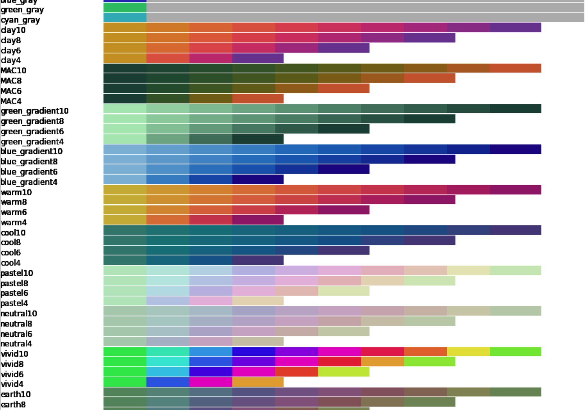

____
## Palettes

Spartan provides several palettes of several types. While you may wish to choose a palette for purely aesthtic reasons, some of spartan's palettes were designed to follow good visualization practices. Choose one because you like it, or choose one because it best matches your communication goal.

To get a feel for how you might use different palettes, considering writing text on a white background. Let's compare two palettes, beginning with the matplotlib default:

 How easy is this to read?  
 How easy is this to read?  
 How easy is this to read?  
 How easy is this to read?  
 How easy is this to read?  
 How easy is this to read?  
 How easy is this to read?  
 How easy is this to read?  
 How easy is this to read?  
 How easy is this to read?  

Second, this is the spartan earth palette (also with a color cycle of length 10):
                                   
 How easy is this to read?  
 How easy is this to read?  
 How easy is this to read?  
 How easy is this to read?  
 How easy is this to read?  
 How easy is this to read?  
 How easy is this to read?  
 How easy is this to read?  
 How easy is this to read?  
 How easy is this to read?  

____
### Varying Hue

Two types of varying hue palettes are available. The palettes listed in this table are intended to be used when the range of hues needs to be maximized and there is no risk of color bias. The palettes have been designed to work well on a white background and minimize bright colors that are difficult to see (e.g.,  light yellows  or  greens  ).

A bit on the algorithm	used....

Each of the palettes comes in a set of four to allow for different repeat cycles. Replace each of the names given in the table with that name with the number $4, 6, 8, 10$ to indicate your desired cycle length, as in `earth4` or `pastel10`. A shorter cycle has more hue contrast among the colors, whereas the hue gradients are necessarily less when the cycle is longer. 

| palette name | description |
|--------------|-------------|
| `soft`    | four (4, 6, 8, 10) repeat cycles |
| `earth`    | four (4, 6, 8, 10) repeat cycles |
| `vivid`    | four (4, 6, 8, 10) repeat cycles |
| `neutral`    | four (4, 6, 8, 10) repeat cycles |
| `pastel`    | four (4, 6, 8, 10) repeat cycles |

Four palettes are provided that have a smaller number of hues and can be used to indicate a transition from extreme to another. For example, the `MAC` palette smoothly transitions from green to orange, whereas `clay` and `warm` only use hues from the warmer portion of the spectrum. As above, each of these palettes is available in four cycle lengths, as in `MAC10` or `warm8`.

| palette name | description |
|--------------|-------------|
| `cool`    | cyan start, ten grays, repeat |
| `warm`    | green start, ten grays, repeat |
| `MAC`    | green start, ten grays, repeat |
| `clay`    | green start, ten grays, repeat |

____
### Constant Hue

In some cases we do not want color changes to imply that something has changed other than perhaps a numerical value, such as height. In these use cases we desire a single color that continuously shifts not in hue but in saturation and/or brightness. As above, there are four cycle lengths: `blue_gradient4` through `blue_gradient10`. 

| palette name | description |
|--------------|-------------|
| `blue_gradient`    | green start, ten grays, repeat |

____
### Grays

We often wish to call attention to a specific curve, or small subset of curves, in the background of reference data. Color can be used to aid the viewer to see this distinction. A common choice is to make the reference curves gray and the main curve a bright color. We provide two types of palettes for this use case. The first palette begins on a bright color and subsequent colors are gray: plot your most important curve first, then all of the reference curves. The second type uses a gradation in the gray levels to indicate that each curve is less important, as when there is a trend among the curves not captured by the axes (e.g., each curve is from a different year and the most recent is most relevant). 

| palette name | description |
|--------------|-------------|
| `cyan_gray`    | cyan start, ten grays, repeat |
| `green_gray`    | green start, ten grays, repeat |
| `blue_gray`    | blue start, ten grays, repeat |
| `red_gray`    | red start, ten grays, repeat |
| `purple_gray`    | purple start, ten grays, repeat |
| `orange_gray`    | orange start, ten grays, repeat |

| palette name | description |
|--------------|-------------|
| `cyan_graydient_fine`    | cyan start, eleven lightening grays, repeat |
| `green_graydient_fine`    | green start, eleven lightening grays, repeat |
| `blue_graydient_fine`    | blue start, eleven lightening grays, repeat |
| `red_graydient_fine`    | red start, eleven lightening grays, repeat |
| `purple_graydient_fine`    | purple start, eleven lightening grays, repeat |
| `orange_graydient_fine`    | orange start, eleven lightening grays, repeat |

| palette name | description |
|--------------|-------------|
| `cyan_graydient_coarse`    | cyan start, six lightening grays, repeat |
| `green_graydient_coarse`    | green start, six lightening grays, repeat |
| `blue_graydient_coarse`    | blue start, six lightening grays, repeat |
| `red_graydient_coarse`    | red start, six lightening grays, repeat |
| `purple_graydient_coarse`    | purple start, six lightening grays, repeat |
| `orange_graydient_coarse`    | orange start, six lightening grays, repeat |
